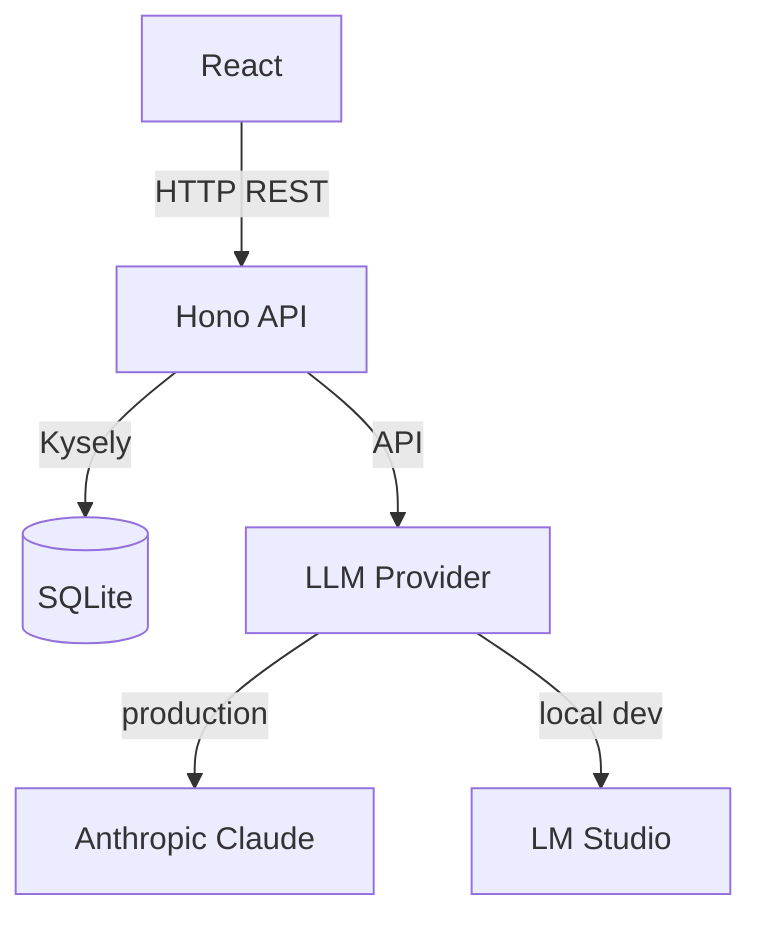

# Transcript Summarization & Translation Service

A tool for doctors to summarize patient discussion transcripts and other medical text, with support for multiple languages, styles, and tones.

## Architecture



## Tech Stack

- **Frontend**: React, Vite, Tailwind CSS
- **Backend**: Node.js, Hono
- **Database**: SQLite via Kysely
- **AI**: Anthropic Claude in production, LM Studio for local dev
- **Monorepo**: pnpm workspaces + Turborepo

## Getting Started

### Prerequisites

- Node.js 20+
- pnpm 10+
- A running [LM Studio](https://lmstudio.ai) instance for local dev

### Install dependencies

```bash
pnpm install
```

### Configure environment

Edit `.env.local` for local development:

Variables:
- `LM_STUDIO_URL`: Base URL of your LM Studio server
- `AI_MODEL`: Model name loaded in LM Studio 

**Production:** Set `ANTHROPIC_API_KEY` and `NODE_ENV=production` as environment variables in your hosting platform.

### Run database migrations

```bash
pnpm db:migrate
```

### Start development servers

```bash
pnpm dev
```

Starts both the frontend (http://localhost:5173) and backend (http://localhost:3001) concurrently.

### Run tests

```bash
pnpm test
```
