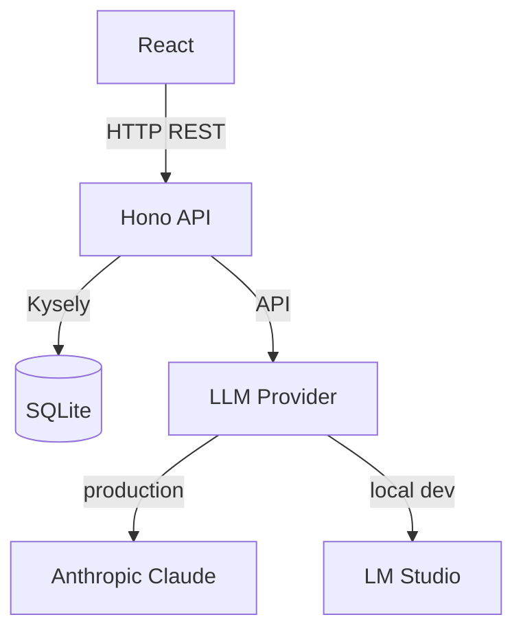

# Transcript Summarization & Translation Service

A tool for doctors to summarize patient discussion transcripts and other medical text, with support for multiple languages, styles, and tones.

## Architecture



## Tech Stack

- **Frontend**: React, Vite, Tailwind CSS
- **Backend**: Node.js, Hono
- **Database**: SQLite via Kysely
- **AI**: Anthropic Claude in production, LM Studio for local dev
- **Monorepo**: pnpm workspaces + Turborepo

## Features

### Summarization

- Paste text or upload a file to summarize it with a single click
- Summaries are stored and persist across page refreshes. The most recent summary is shown automatically on load
- Full summary history is accessible from the sidebar

### Language and style

- Choose the output language (English, Finnish, Swedish, and more)
- Choose a tone: **Clinical** (formal medical language), **Simple** (plain language, no jargon), or **Detailed** (comprehensive, preserves all key findings)

### File upload

- Upload a plain-text file via the upload button or by dragging and dropping it onto the text area
- Supported formats: `.txt`, `.md`, `.csv`
- PDF and Word documents are not supported. Supporting them would require third-party parsing libraries for each format.

### Security

- AI endpoints are protected by a server-side password (`AI_PASSWORD` env var)
- The password is entered in the UI header and saved to session storage. It persists for the duration of the browser session and is cleared when the tab is closed

## Prompts

- [Claude prompting best practices](https://platform.claude.com/docs/en/build-with-claude/prompt-engineering/claude-prompting-best-practices)

## Getting Started

### Prerequisites

- Node.js 20+
- pnpm 10+
- A running [LM Studio](https://lmstudio.ai) instance for local dev

### Install dependencies

```bash
pnpm install
```

### Configure environment

Edit `.env.local` for local development:

Variables:

- `LM_STUDIO_URL`: Base URL of your LM Studio server
- `AI_MODEL`: Model name loaded in LM Studio

**Production:** Set `ANTHROPIC_API_KEY` and `NODE_ENV=production` as environment variables in your hosting platform.

### Run database migrations

```bash
pnpm db:migrate
```

### Start development servers

```bash
pnpm dev
```

Starts both the frontend (http://localhost:5173) and backend (http://localhost:3001) concurrently.

### Run tests

```bash
pnpm test
```

## Production

The app is deployed on [Railway](https://railway.com). Pushes to `main` deploy automatically.

**Environment variables to set in Railway:**

- `NODE_ENV=production`
- `ANTHROPIC_API_KEY` - your Anthropic key
- `AI_PASSWORD` - password users enter in the UI
- `DB_PATH=/data/data.db` (see below)

**Database persistence:** Railway containers are ephemeral, so the SQLite file needs to live on a mounted volume. Create a volume in your Railway service and mount it at `/data`, then set `DB_PATH=/data/data.db`. Without this the database resets on every deploy.

## Claude Code skills

This repo includes a couple of Claude Code skills in `.claude/skills/` to make common tasks easier:

- **railway-cli** - check logs, inspect deployments, manage env vars, SSH into the service
- **kysely-cli** - create and run migrations, seed the database, run one-off SQL queries
